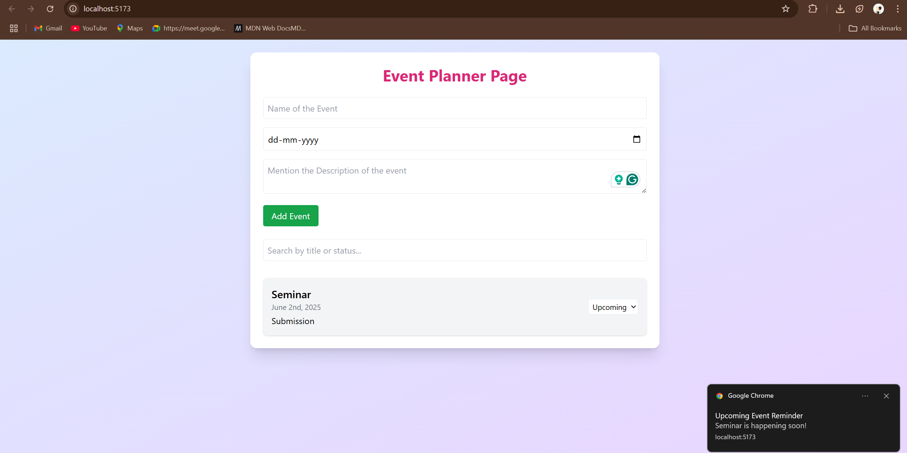
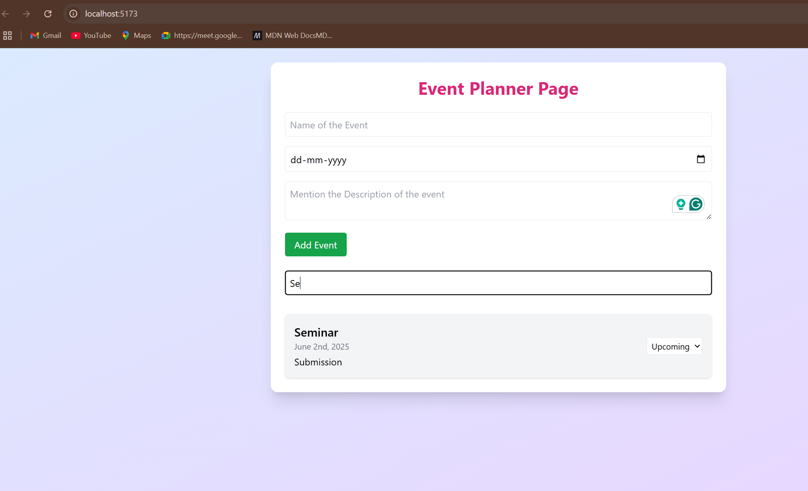

# 🎉 Event Planner App

A simple and beautiful event planning application built with **React**, **Tailwind CSS**, and **Vite**. Users can add events, update statuses, receive browser notifications for upcoming events, and filter through a searchable list.

---

## ✨ Features

- 📅 Add and manage events
- 🔔 Local browser notifications for upcoming events (within 24 hours)
- 🔍 Search and filter by event title or status
- 🎨 Responsive, modern UI with Tailwind CSS
- 📂 Easy to extend for future features like Firebase, calendar view, etc.

---

## 🛠 Tech Stack

- React 18
- Tailwind CSS 3
- Vite
- date-fns (for date formatting)

---

